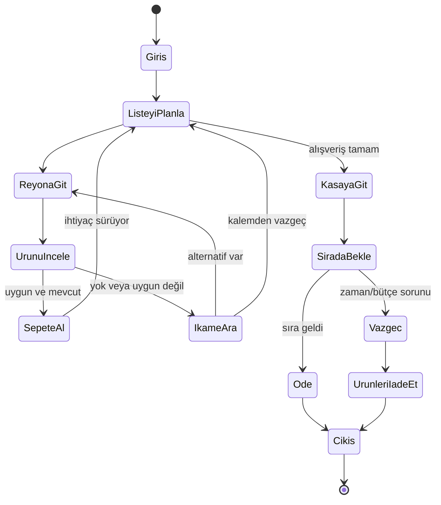

# Davranış, otomatik yerleşim ve öğrenen modeller

Durum: mimari ve deney planı. Bu turda model eğitimi, oyun kodu veya veri seti oluşturulmadı. "Yapay zekâ" başlığı altındaki her özellik sinir ağı gerektirmez.

## 1. Karar tablosu

| İş | İlk çözüm | Eğitim gerekiyor mu? | Öğrenme daha sonra ne katabilir? |
|---|---|---|---|
| Müşterinin yolu bulması | NavMesh, yol arama, kalabalık kaçınma | Hayır | Ancak ölçülmüş sıra dışı hareket sorunu varsa |
| Ürün ve mağaza seçimi | Tercih/yarar puanlama, bütçe ve bellek | Hayır | Parametre kalibrasyonu ve alternatif politika |
| Kasa/servis kuyruğu | Ayrılmış konumlar, sıra kuralları | Hayır | İlk tasarımda gerek yok |
| Çalışan görevleri | Öncelik, uygunluk ve görev atama | Hayır | İleri lojistik optimizasyonu |
| Rakip stratejisi | Bütçeli eylem puanlama ve kısa planlama | Hayır | Kontrollü strateji çeşitlendirme deneyleri |
| Otomatik şube planı | Şablon, kısıt çözümü ve aday değerlendirme | Hayır | Aday planları hızlı sıralayan model |
| Marka uyumu | Renk/malzeme/tabela kuralları | Hayır | Stil önerisi; son yerleşim kural denetimli |
| Satış tahmini | Mevsimsel/istatistiksel başlangıç modeli | Başlangıçta hayır | Yeterli oyun verisiyle tahmin iyileştirme |
| Kutu/etiket üretimi | Dışarıda üretken araç + insan düzenlemesi | Bize özel eğitim gerekmez | Tutarlı sanat için isteğe bağlı özel stil modeli |
| Diyalog/olay metni | Yazılmış parçalar ve durum şablonları | Hayır | İsteğe bağlı dil modeliyle metin varyasyonu |

İlk oynanabilir hedefin çalışması internet bağlantısına veya her NPC için API çağrısına bağlı olmayacak. LLM, gerçek stok/para işlemine doğrudan karar veren otorite yapılmaz.

## 2. Müşteri karar mimarisi

Üç katman ayrılır:

**Niyet:** Neden geldi? Hangi ürün gruplarına ihtiyacı var, ne kadar bütçesi/zamanı var?

**Karar:** Hangi ürünü alsın, ikame kabul etsin mi, bir sonraki reyon hangisi, kuyrukta kalsın mı?

**Hareket ve etkileşim:** Yola çık, ürüne yaklaş, bir etkileşim noktasını ayır, animasyonu oynat, durumu güncelle.

Karar örneği: seçenek puanı = ihtiyacı karşılama + alışkanlık + kalite tercihi + kampanya etkisi − fiyatın bütçeye etkisi − yürüyüş/bekleme maliyeti. Bileşenler aynı ölçeğe normalize edilir. Sabit katsayıların gerçek insan psikolojisini bilimsel kesinlikle temsil ettiği iddia edilmez; oyun testleriyle ayarlanır.

Her müşteri sınırlı bilgi kullanır: gördüğü etiket, bildiği marka, deneyimlediği hizmet ve beklenti. Depodaki görünmez ürünü otomatik bilmez. Personelden sorma eylemi bilgi ekleyebilir.

## 3. Durumlar ve geçişler

Servis reyonu, danışma ve hacimli ürün teslimi bu akışın alt durumlarıdır. Stok rezervasyonu ürün etkileşiminin başlangıcında kısa süreli, sepete alındığında sepet sahipliğine dönüşür. İptal/süre aşımı rezervasyonu bırakır. Kasada ödeme başarılı olmadan satışı iki kez yazan geçiş olamaz.

Sepetteki fiyat politikası açık seçilir: öneri, sepete girişte müşteriye gösterilen fiyatı korumak. Kampanya şartlarının sağlanması ayrı kontrol edilir. Daha sonra raf fiyatının değişmesi sepette sürpriz yaratmaz.

## 4. Unreal tarafında araç seçimi

Öneri: karar/akış için StateTree, etkileşim noktaları için Smart Objects benzeri rezervasyon düzeni, yol için Navigation System, yakın kalabalık için tek kaçınma yöntemi. Epic StateTree'yi hiyerarşik durum makinesi, Smart Objects'ı rezervasyonla kullanılabilen etkinlikler olarak tanımlar. [StateTree](https://dev.epicgames.com/documentation/en-us/unreal-engine/state-tree-in-unreal-engine), [Smart Objects](https://dev.epicgames.com/documentation/en-us/unreal-engine/smart-objects-in-unreal-engine).

İlk aday Detour Crowd'dur; örnek mağazada agent kapasitesi ve dar koridor davranışı ölçülür. RVO ile Detour aynı karakterde üst üste açılmaz. Yol bulma ile hareketli insanlardan kaçınma farklı görevlerdir. [Epic kaçınma rehberi](https://dev.epicgames.com/documentation/unreal-engine/using-avoidance-with-the-navigation-system-in-unreal-engine).

Kural tabanlı davranışın güncellenme sıklığı görüntü karesinden ayrılır. Her karede bütün marketi tarayıp yeni ürün seçilmez. Sahne ve müşteri sayısı büyüdüğünde ayrıntı düzeyi azaltılır; önce ölçüm, sonra gerekirse veri odaklı kalabalık yaklaşımı değerlendirilir.

## 5. Yol, kuyruk ve sıkışma

Raf modeli çevresinde çarpışma, müşteri yaklaşma noktası, çalışan doldurma noktası ve geçiş açıklığı ayrı tanımlanır. Sepetli müşteri ile alışveriş arabalı müşterinin kapladığı alan farklıdır.

Kuyruk bir çizgiye doğru koşan NPC listesi değildir: servis noktası, bekleme slotları, giriş/çıkış ve taşma alanı bulunur. Slot rezervasyonu aynı noktaya iki kişiyi göndermez. Kasa kapatılınca mevcut müşteri, son alınacak kişi ve yeni müşterilerin yönlendirmesi belirlenir.

Tıkanma çözümü: kısa bekle → yerel yeniden yol → hedefi ertele/alternatif etkileşim → personel yardımı veya ayrılma. Yalnızca gizli kurtarma mekanizmasına başvurulursa olay hata günlüğüne düşer; görünürde duvar içinden geçme normal davranış sayılmaz.

Oyuncu raf yerini değiştirdiğinde etkilenen navigasyon/etkileşim bölgeleri yeniden doğrulanır. Aktif reyon taşınacaksa iş geçici olarak kapanır ve müşterilerin ayrılmış işlemleri çözümlenir. Rafı müşteri içine yerleştirip işlemi başarı saymak yasaktır.

## 6. İnandırıcılık için küçük ayrıntılar

Müşteri etikete kısa bakabilir, bir ürünü karşılaştırabilir, listeyi kontrol edebilir, eli doluyken sepet alabilir, yanlış koridordan dönebilir, personelden yardım isteyebilir. Bu mikro davranışlar ana hedefi tamamlamayı engellemez ve herkeste aynı sırayla tekrarlanmaz.

Yürüme animasyonu ile karar yapay zekâsı ayrı işlerdir. İlk çözüm hazır/üretilmiş animasyon, dönüş geçişleri ve erişim noktalarıdır; karaktere fiziksel olarak yürümeyi sıfırdan öğretmek gerekli değildir. El-ürün hizası için farklı tutuş noktaları, gerekirse IK uyarlaması gerekir. Aynı uzanma animasyonu televizyona ve sakıza uygulanmaz.

## 7. Çalışan davranışı

Görev kuyruğu olaylardan doğar: boş raf, teslimat, kasa desteği, temizlik, servis ve mola. Uygunluk kontrolü rol, ekipman, konum, vardiya ve yetkiyi kullanır. Öncelik; müşteri kaybı, bozulma, süre, yürüme ve yöneticinin kuralına bağlıdır.

Çalışan bir görevi ayırır, kaynağı alır, taşır/uygular ve sonucu bildirir. İşin yarıda kalması stokun havada kalmasına neden olmaz; taşıdığı koli veya mal transfer lokasyonuna bağlıdır. Birden çok çalışan aynı 12 ürünü iki kez almaz.

## 8. Otomatik mağaza tasarımının girdileri

- Binanın kullanılabilir poligonu, kolonlar, yükseklik, giriş/çıkış, yükleme, su/elektrik noktaları.
- Format, bütçe, hedef açılış tarihi, ürün karması ve departman listesi.
- Kurumsal kimlik profili ve zorunlu/isteğe bağlı dekor.
- Müşteri segmentleri, beklenen yoğunluk, sepet/alışveriş arabası varsayımları.
- Ekipman kütüphanesi, ölçüler, hizmet/üretim kapasitesi ve bağlantı kuralları.
- Oyuncunun kilitlediği alanlar ve tercih ettiği düzen: ızgara, çevre dolaşımı, serbest akış veya karma.

Çıktı yalnızca bir mağaza resmi değildir: ekipman yerleşimleri, planogram önerisi, dolaşım ağı, departman alanları, altyapı listesi, satın alma bütçesi ve açıklamalı kalite raporudur.

## 9. Yerleşim yöntemi

1. Kabuk verisini doğrula; kendini kesen poligon veya eksik kapı varsa bildir.
2. Zorunlu bölgeleri ayır: mal kabul, depo, çıkışlar, kasa ve personel alanı.
3. Departmanları yakınlık/altyapı gereksinimine göre bölgelere ata.
4. Uygun ekipman şablonlarını ölçülere uydur; modül sayısını seç.
5. Sert kısıtları kontrol et: çakışma, yol, erişim, yük, enerji ve alan.
6. Geçerli adayları maliyet, dolaşım, kuyruk, kapasite ve marka uyumuna göre puanla.
7. Sentetik müşteri/ikmal akışlarıyla darboğaz kontrolü yap.
8. Oyuncuya **Ekonomik / Dengeli / Hizmet odaklı** gibi üç anlaşılır alternatif sun.
9. Oyuncunun değişikliklerini kilitle ve kalan alanı yeniden çöz.
10. Kabul edilen plandan yatırım/satın alma ve kurulum işleri üret.

PCG, kabul edilmiş planı sahnede yerleştirme ve dekor varyasyonunda kullanılabilir; tek başına kârlı ve erişilebilir mağaza planı bulan bir eğitimli sistem değildir. [Epic PCG çerçevesi](https://dev.epicgames.com/documentation/en-us/unreal-engine/procedural-content-generation-overview).

İlk çözücü basit şablon + kısıtlı arama olabilir. Alan/personel tahsisi gibi ayrık alt problemler için OR-Tools CP-SAT adaydır. Tam serbest geometriyi otomatik olarak çözeceği varsayılmaz; alan ızgarası/modüller, yönelim ve kısıtlar bizim tarafımızdan modellenir. CP-SAT tam sayı değişken/kısıtlarla çalışır. [Google CP-SAT](https://developers.google.com/optimization/cp/cp_solver).

Oyun çalışma zamanında Python veya dış bulut servisine zorunlu bağlanmak ilk tercih değildir. Tasarım aracı offline çözüm hazırlayabilir; runtime çözücü gerekiyorsa C++ entegrasyonu, lisans/dağıtım ve sürüm maliyeti ayrıca değerlendirilir.

## 10. Sert ve yumuşak kısıtlar

**Sert:** engellenmeyen çıkış ve ana yollar; ekipman çakışması yok; ürün/reyon uyumu; servis noktası erişimi; bütçe üst limiti seçilmişse aşılmaması; fiziksel altyapı kapasitesi; kilitlenmiş bölgelerin korunması.

**Yumuşak:** yürüme mesafesi, reyon yakınlığı, kampanya görünürlüğü, personel ikmal mesafesi, kuyruk ortalaması/kuyruğu, enerji, estetik ve marka tutarlılığı. Ağırlıklar formatla değişir; tek evrensel "en iyi mağaza" yoktur.

Sistem çözüm bulamazsa geçersiz planı başarı diye döndürmez: "İstenen kasap+restoran ve mevcut depo bu alana sığmıyor; departmanı küçült, depo dışarı taşı veya programı değiştir." Süre sınırına ulaştıysa "bulunan en iyi geçerli aday" ile "optimal olduğu kanıtlanmış çözüm" ayrılır. Çözüm yokluğu ile arama süresinin yetmemesi aynı değildir.

## 11. Gerçekten eğitim yapılırsa: ilk deney

Önerilen ilk öğrenme problemi **aday mağaza planlarını sıralamak**. İnsan yürümesinden veya tüm şirketi yöneten genel bir modelden daha dar, ölçülebilir bir görevdir.

Eğitim ön koşulları: çalışan kural tabanlı yerleşim, kararlı trafik simülasyonu, kayıt/tekrar oynatma, ölçülebilir hedefler ve karşılaştırma temeli. Bunlar oluşmadan "model eğitiyoruz" aşamasına geçilmez.

Deney planı:

1. Farklı bina kabukları ve yoğunluk profilleri üret; kısıt çözücüyle geçerli adaylar çıkar.
2. Her adayda birden fazla talep tohumu çalıştır; kuyruk, yürüme, ikmal, maliyet ve karşılanan talebi kaydet.
3. İnsan tasarımcının tercihlerini ve açıklamalarını ayrı etiket olarak ekle; gerçek satış verisiyle karıştırma.
4. Bina ailelerini tamamen ayırarak eğitim/doğrulama/test bölmesi yap. Aynı mağazanın küçük varyantları farklı bölmelere sızmasın.
5. Basit istatistiksel sıralama modeliyle başla; daha karmaşık ağ ancak anlamlı ek fayda varsa.
6. Yeni planlar üretildiğinde model yalnızca aday önceliklendirir. Sert kısıt kontrolünü geçersiz kılamaz.
7. Ayrılmış test mağazalarında temel yönteme göre hız/kalite ve kötü uç durumları karşılaştır.
8. Model ağırlığı, şema, eğitim sürümü ve ölçüm raporunu birlikte paketle; geri dönüş yolu tut.

Pilot veri bütçesi önerisi: onlarca farklı kabuk, her kabuk için çoklu aday ve talep tekrarlarıyla başla; öğrenme eğrisine göre genişlet. Belirli bir örnek sayısının yeterli olduğu garanti edilmez. Toplanan veri oyunun simülasyonundan geldiği için modelin gerçek perakende optimumunu öğrendiği de iddia edilmez.

## 12. Taklit veya pekiştirmeli öğrenme deneyi

Yalnızca belirli bir çalışan/karar problemi kurallı temel yaklaşımı aşacak fayda gösterirse düşünülür.

- **Gözlem:** izin verilen yerel talep, stok, görev kuyruğu, ulaşım ve zaman; oyuncunun gizli geleceği yok.
- **Eylem:** sınırlı görev/ürün/rota seçimi; doğrudan nakit yazmak veya duvar içinden geçmek yok.
- **Ödül:** tamamlanan meşru görev, az bekleme, az fire; yanlış işlem, tıkanma ve maliyet cezaları.
- **Sömürü önleme:** müşteriyi sonsuz dolaştırarak görünür süreyi artırma, satış kaydını tekrar tetikleme veya sahte görevi tamamlama ödül getirmez.
- **Eğitim:** önce iyi çalışan kural/insan örnekleri; sonra gerekirse kontrollü pekiştirme.
- **Değerlendirme:** yeni düzenler, yoğun kalabalık, stok yokluğu, kapanan kasa, engellenen koridor ve farklı ürün boyları.
- **Dağıtım:** oyun içinde yalnızca çıkarım; eğitim geliştirme ortamında. Hata veya desteklenmeyen durumlarda güvenilir kurallı yola dön.

Epic'in Learning Agents eklentisi pekiştirmeli/taklit öğrenmeyi destekleyen bir seçenek; 5.8 belgelerinde **Experimental** olarak işaretli. Bu yüzden temel oyun mimarisi onun zorunlu çalışmasına bağlanmaz. [Learning Agents](https://dev.epicgames.com/documentation/unreal-engine/API/PluginIndex/LearningAgents).

Eğitilecek model seçilmeden GPU veya eğitim süresi tahmini verilmez. Önce küçük deneyle simülasyon adım hızı, bellek ve veri ihtiyacı ölçülür. Ücretli bulut eğitimi ancak ölçülmüş gereksinim ve kullanıcı bütçesiyle planlanır.

## 13. Dil modeli için sınırlı rol

Olay açıklaması, müdür raporunu okunaklılaştırma veya diyalog varyasyonu olabilir. Oyun verisinin yapısal doğruları motor tarafından sağlanır; dil modeli yalnızca verilen gerçekleri anlatır. Çıktıdaki sayılar ve eylemler şemayla doğrulanır. Servis kapalıysa hazır metinler çalışır. Bu özellik ilk hedef için gerekli değildir.

Promptla etiket üretmek, NPC eğitmek ve satışı tahmin etmek üç farklı iş akışıdır. Birine abonelik almak diğer ikisini kendiliğinden sağlamaz.

## 14. Küresel ölçekte simülasyon

Ziyaret edilen mağaza ayrıntılı NPC/raf etkileşimi kullanır. Yakın ama görünmeyen mağazada azaltılmış ayrıntı, uzak şubede zaman dilimli talep/kapasite/stok akışı çalışır. Ekonomik varlıkların tek sahibi kampanya durumudur.

Her şubenin son işlendiği zaman, açık işlemleri, stok rezervasyonları ve rastgelelik durumu kaydedilir. Mod değiştirmede önce mevcut zaman dilimi kapatılır, durum aktarılır, yeni gösterim başlatılır. Aynı dakika hem ayrıntılı hem özet motor tarafından tekrar satılmaz.

Özet simülasyon mekânsal bütün hareketleri birebir yeniden üretmez. Para/stok korunumu kesin; eşdeğer koşullarda talep, hizmet ve fire sonuçlarının yakınlığı istatistiksel olarak test edilir. Küçük farklar kabul aralığında, sistematik avantaj/dezavantaj hata olarak değerlendirilir.

Tohum ve sürümle tekrar oynatma hedeflenir; farklı motor/işletim sistemi sürümlerinde tüm kayan nokta fiziğinin bit düzeyinde aynı olacağı vaat edilmez. Finansal kayıtlar için deterministik işlem sırası ayrıca korunur.

## 15. Kabul kapıları

NPC için geçerli hedefe ulaşma, sıra ihlali, duvar geçişi, çifte rezervasyon, kurtarılamayan sıkışma ve terk nedeni ölçülür. Yerleşimde sıfır sert kısıt ihlali hedeflenir; bulunamayan çözüm açık raporlanır. Öğrenen modelde temel yönteme karşı fayda, kötü uç durum ve bellek/çıkarım maliyeti ölçülür.

Bu kapıları geçmeyen eğitimli model, sırf "AI kullanılmış" olması için oyuna alınmaz.
