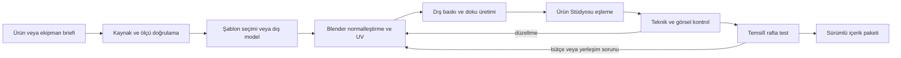

> **ARŞİV (06.10.2026):** Bu belge M69 öncesi kurguyu ve eski planı anlatır (2011, Lüleburgaz, "Miras Market", babadan kalan dükkân, hikâye bölümleri). **Güncel değildir; ajanlar buna göre kod ya da metin yazmasın.** Güncel kurgu `Docs/Kurgu/00_KURGU_KITABI.md`, kararlar `Docs/Kurgu/01_KARARLAR.md`, durum `Docs/Surec/DURUM.md`.

# Üretim süreci, araçlar ve doğrulama kapıları

Durum: gelecekte uygulanacak plan. Bu tur yalnızca belgeler/promptlar üretir; prototip geliştirmesi, yeni varlık üretimi, araç kurulumu veya eğitim çalıştırılması kapsam dışıdır.

## 1. Araç kararları

| Araç | Görev | Öncelik / sınır |
|---|---|---|
| Unreal Engine 5.8.3 | Oyun, simülasyon, menüler, editör entegrasyonu | Mevcut proje sürümü; yükseltme ayrı uyumluluk kararı |
| Blender | Ölçülü model, UV, pivot, normal, sadeleştirme, kaynak dosya | Ana üretim ve düzeltme aracı; sürüm pilotta sabitlenir |
| Meshy | Referanstan veya metinden 3B taslak; biçim keşfi | İsteğe bağlı hızlandırıcı; teknik kabulden muaf değil |
| Kullanıcının görüntü üreticisi | Ambalaj grafiği, konsept ve kontrollü fotoğraf düzenleme | Promptlar araçtan bağımsız; hassas metin/UV sonradan kontrol |
| Krita veya mevcut katmanlı görsel editörü | Etiket kompozisyonu, yazı/logoyu yerleştirme, rötuş | Tek bir uygun editör yeterli; hepsini edinmek gerekmez |
| Figma veya eşdeğer UX aracı | Ekranlar, bileşenler, tıklanabilir menü akışı | Kodlamadan önce kullanılabilirlik denemesi |
| Substance 3D Painter | Zor özel UV'ler ve ayrıntılı yüzey kaplama | İsteğe bağlı; ilk düz kutu için zorunlu değil |
| Houdini / Houdini Engine | İleri parametrik varlık/bina üretimi | İlk aşamada zorunlu değil; üretim ölçeği haklı çıkarırsa |
| OR-Tools | Yerleşim/personel gibi uygun ayrık optimizasyon alt problemleri | Önce küçük deney; runtime entegrasyonu ayrı iş |
| Learning Agents / seçilecek ML araçları | Gerekçesi oluşan dar öğrenme deneyi | İlk oyunun ön koşulu değil |
| Sürüm kontrolü + büyük dosya yönetimi | Kod, içerik ve şema geçmişi | İlk gerçek üretimden itibaren |

Blender'ın düğüm tabanlı geometri araçları parametrik varyasyonlarda kullanılabilir; bu model eğitimi değildir. [Blender Geometry Nodes](https://docs.blender.org/manual/en/latest/modeling/geometry_nodes/introduction.html).

Meshy'nin belgeleri FBX/GLB gibi dışa aktarma seçeneklerini, ayrıca motor kullanımından önce ölçü/topoloji/performans düzenlemelerini tarif ediyor. Pazarlamadaki "game-ready" ifadesi bizim kabul testimizin yerine geçmez. [Meshy çıktı biçimleri](https://docs.meshy.ai/en), [oyun varlığı hazırlama rehberi](https://help.meshy.ai/en/articles/15723950-how-to-make-meshy-models-game-ready).

Krita katmanlı çalışma; Figma etkileşimli bileşen/prototip; Painter özel doku kaplama; Houdini Engine ise Unreal'a prosedürel üretim araçları bağlama için kullanılabilir. Bunlar ayrı ihtiyaçlar, tek bir zorunlu abonelik paketi değildir. [Krita](https://docs.krita.org/en/reference_manual/layers_and_masks.html), [Figma](https://help.figma.com/hc/en-us/articles/360061175334-Create-interactive-components-with-variants), [Painter](https://www.adobe.com/products/substance3d/apps/painter.html), [Houdini Engine](https://www.sidefx.com/products/houdini-engine/plug-ins/unreal-plug-in/).

Houdini araçlarının editörde üretim yapması, son oyuncunun bilgisayarında aynı üretimi sınırsız çalıştırabileceğimiz anlamına gelmez; dağıtım/çalışma zamanı koşulları seçilen sürüm ve kullanım için ayrıca kontrol edilir. Aynı ayrım FBX importer için de geçerlidir.

Bu belgede abonelik ücreti veya toplam araç maliyeti sabitlenmedi. Bölge, plan ve kullanım koşulları satın alma anında doğrulanır. Sırf listede yer aldığı için hiçbir araç satın alınmaz veya kurulmaz.

## 2. Minimum pratik başlangıç seti

Unreal + Blender + bir katmanlı görsel editörü yeterli teknik başlangıçtır. Kullanıcının seçtiği bir dış görüntü üreticisi ve gerektiğinde Meshy üretimi hızlandırabilir. Menü akışını oyun koduna girmeden test etmek için UX aracı eklenir. Öğrenen AI, Houdini ve ücretli özel texturing araçları ilk bağımlılık değildir.

## 3. Üretim hattı

Model doğrulanmadan son baskı üretilmez. UV değişirse eski atlasın uyumu tekrar kontrol edilir. Şablonlu yüz yaklaşımında yüz kaynakları korunur ve yeni atlas tekrar üretilebilir; tüm etiketi yeniden çizmek gerekmez.

## 4. Kullanıcı ve geliştirme sorumlulukları

| Kullanıcı/dış üretim | Geliştirme ekibi | Ortak karar |
|---|---|---|
| Gerçek ürün seçimi ve referansları | Şablon/UV ve dosya sözleşmesi | Dönem ve görsel hedef |
| Dış araçta model/etiket üretimi | Ürün Stüdyosu ve doğrulama | Kabul edilen örnek kalite |
| Belirsiz marka yazısını doğrulama | Raf/etkileşim/simülasyon entegrasyonu | Ürün ve departman sırası |
| Kaynak ve prompt kaydı | Sürüm, paketleme ve kayıt uyumluluğu | Gerekli satın alma bütçesi |
| İlk oynanış tercihlerine geri bildirim | Test raporu ve hata düzeltme | Eğitimin gerekip gerekmediği |

"AI yaptı" teslimde ölçü/UV kontrol sorumluluğunu kaldırmaz. Dış araç bozuk model döndürürse oyun kodunda her varlık için özel yamayla telafi etmek yerine kaynağı/normalleştirmeyi düzeltiriz.

## 5. Aşamalar

| Kapı | Yapılacak iş | Bağımlılık | İncelenebilir çıktı ve kabul |
|---|---|---|---|
| P0 — Tasarım | Bu planı karar kaydına dönüştür | Kullanıcı tercihleri | Çelişen varsayımlar kapanır; ilk kapsam belirlenir |
| P1 — Menü akışı | Özet, sipariş, stok, personel, finans ve tasarım ekranları | P0 | Tıklanabilir makette temel görevler anlaşılır |
| P2 — Varlık pilotu | Kutu, şişe, yumuşak paket, raf ve soğuk dolap denemesi | 03 standardı | Ölçü, UV, etiket, raf sığması ve örnek performans |
| P3 — Simülasyon temeli | Kimlik, birim, para, stok partisi, işlem ve kayıt | P0 | Korunum ve kayıt testleri; ekonomi görselden bağımsız |
| P4 — Ürün Stüdyosu | Şablon/custom import, etiket, önizleme, doğrulama, sürüm | P2/P3 | Kullanıcı kod yazmadan pilot ürün ekler; yanlış giriş anlaşılır reddedilir |
| P5 — İlk bütünleşik market | Menüler, sipariş, mal kabul, raf, müşteri, kasa | P1–P4 | Bir günün bütün mal/para akışı ve bir sonraki gün çalışır |
| P6 — Yerel derinlik | Personel, fire, iade, kampanya, rakip ve nakit sıkıntısı | P5 | Birkaç uygulanabilir strateji, açıklanabilir sonuçlar |
| P7 — Bölüm çeşitliliği | Manav, pastane/kasap gibi temsilî servis ve üretim | P6 | Üretim girdisi, sıra, personel ve maliyet birbiriyle tutarlı |
| P8 — İkinci gerçek şube | Ayrı şube durumu, müdür, delege işler, uzak simülasyon | P6/P3 | Ziyaret geçişinde stok/para çoğalmıyor; iş devri gerçek |
| P9 — Otomatik yerleşim | Kabuk, bölge, ekipman, marka, kısıt ve trafik | P4/P5/P7 | Farklı şekillerde geçerli adaylar; çözümsüz durum açıklanıyor |
| P10 — Bölgesel lojistik | Depo, rota, ikmal, bakım ve satın alma hacmi | P8 | Teslimat/kapasite darboğazı raporda ve sahnede aynı |
| P11 — Kurumsal rekabet | Departmanlar, yetki, denetim, sahiplik, satın alma | P8/P10 | Yönetici kararları ve şirket işlemleri denetlenebilir |
| P12 — Ulusal ölçek | Çok bölge, format portföyü, konsolidasyon | P11 | Çok şubede oynanabilir performans ve anlamlı hedefler |
| P13 — İlk yabancı pazar | Bir ayrıntılı ülke profili ve yerel uyarlamalar | P12 | Yeni ülke farklı kararlar yaratıyor; kur ve iç işlemler doğru |
| P14 — İçerik ve kampanya | Daha çok ülke/ürün/olay, liderlik ve son oyun | P13 | Uzun kampanya, denge, kararlılık ve içerik kalitesi |
| AR-GE — İsteğe bağlı öğrenme | Dar problemin temel yöntemle kıyaslanması | Ölçülmüş ihtiyaç ve veri | Gösterilmiş fayda; güvenilir geri dönüş yolu |

Bu sırada bazı işler eşzamanlı yürütülebilir: menü tasarımı ile varlık pilotu gibi. Ancak simülasyon temeli oturmadan onlarca ülke ve binlerce ürün girilmez. Eski prototip keşif malzemesidir; onun tek GameMode dosyasını büyüterek bütün oyunu kurmak hedef mimari değildir.

## 6. İçerik üretim dalgaları

**Pilot:** 3 ambalaj ailesi, 2–3 ekipman ailesi, birkaç ürün görünümü. Hedef hattın doğruluğu.

**İlk market:** yaklaşık 20–40 ticari ürün tanımı; az sayıda model şablonu ve etiketten çeşit. Kuru/soğuk/raf dışı birer uç örnek. Sayılar kapsam adayıdır, tamamlanmış içerik değildir.

**Yerel derinlik:** yaklaşık 80–150 ürün ve 8–12 işlevsel ekipman ailesi; ilk taze/servis operasyonları. Aynı ürüne yalnızca renk değiştirerek yüzlerce anlamlı SKU varmış gibi davranılmaz.

**Bölgesel/hipermarket:** yüzlerce SKU, yeni departman aileleri, elektronik demo-kutu ayrımı, farklı mağaza formatları. Var olan geometrileri yeniden kullanmak önceliklidir.

**Uluslararası:** ülke/dönem ve marka paketleri, yerel ürünler ve format uyarlamaları. Ürün adedi tek başına hedef değildir; simülasyon ve kullanıcı arayüzü ölçeği doğrulanır.

Oyunda bin SKU olması bin benzersiz 3B mesh gerektirmez. Aynı ambalaj ailesinin anlamlı boyut varyantları ve ayrı etiketleri içerik maliyetini düşürür. Tüm SKU'ların aynı mesh'e zorlanması da gerçekçi ölçü ve raf yerleşimini bozar.

## 7. Hedef teknik mimari

Tanımlar: Product, Package, BrandPack, Fixture, Department, StoreFormat, Supplier, EmployeeRole, CountryProfile, Scenario.

Kalıcı durum: Company, Ownership, Store, InventoryLot, Location, Order, Shipment, Employee, Task, CustomerBasket, Invoice, JournalEntry ve Event.

Görünüm: mağaza sahnesi, karakterler, ürün örnekleri, menü modelleri. Görünür nesne silindi diye ticari kayıt silinmez. Statik tanım ile kalıcı durumun sürümleri ayrılır.

Komut → doğrulama → atomik durum değişikliği → kayıtlı olay → rapor/görünüm güncellemesi yaklaşımı. Geliştirme sırasında tam event-sourcing gibi ağır bir mimari ancak ihtiyaç varsa; başlangıçta tutarlı işlem kaydı, idempotency ve snapshot yeterli olabilir. "Tek işlem kaynağı" bütün oyunu tek sınıfa koymak anlamına gelmez.

UI ekonomik kuralları kendi içinde tekrar hesaplamaz; simülasyon servisinin verdiği maliyet/kapasite sonucunu gösterir. Öneri, taslak ve gerçekleşen işlem ayrı veri türleridir.

## 8. Ölçek ve performans planı

Hedef donanım henüz kararlaştırılmadı. İlk performans hedef adayı 1080p, ayarlanabilir kalite ve akıcı birinci şahıs hareket. "Şu GPU'da kesin 60 FPS" sözü benchmark olmadan verilmez.

Üç temsilî sahne: küçük dükkân, yoğun süpermarket, büyük hipermarket. Ayrı ölçümler: GPU, oyun thread'i, navigasyon/karar, UI listeleme, bellek, yükleme ve kayıt süreleri. Ortalama kadar kötü kareler ve yoğun anlar da değerlendirilir.

Raf ürünleri örneklenir; uzakta ayrıntı ve animasyon azaltılır; her ürüne sürekli fizik/tick verilmez. Elindeki tek ürün ayrıntılı olabilir. Karakter/ürün sayıları ile materyal sayısı birlikte ölçülür. Nanite veya güçlü ekran kartı simülasyon, bellek, çizim çağrısı ve şeffaflık sorunlarının hepsini otomatik çözmez.

Uzak mağazalar gerçek zamanlı bütün NPC'leri çalıştırmaz. Zaman ilerletme, stratejik kararı etkileyen istisnada durabilir. Büyük kayıt dosyası yazılırken oynanışın bloklanması ve yarım kalmış kayıt riski ayrıca ele alınır.

## 9. Test planı

| Alan | Kabul edilecek kanıt |
|---|---|
| Birim/para | Farklı satış birimleri, para hassasiyeti ve yuvarlama örnekleri |
| Stok | Rezervasyon, sepet, transfer, fire, iade ve üretimde korunum |
| Sipariş | Kısmi teslim, iptal, tekrar tıklama, gecikme, hasar ve mükerrer mesaj |
| Finans | Ciro/kâr/nakit ayrımı; borç anaparası; iç satışın eliminasyonu |
| Kayıt | Atomik kayıt, yedek, sürüm geçişi, eksik içerik paketi |
| Ürün import | Ölçü, ön yüz, UV, normal, materyal, raf ve görünüm |
| NPC | Dar geçiş, sıra, kapalı kasa, ulaşılamayan ürün ve iptal temizliği |
| Personel | Aynı işin iki kez yapılmaması, yarım kalan görev, vardiya/izin |
| Yerleşim | Sıfır sert kısıt ihlali; geçerli/çözümsüz/zaman aşımı ayrımı |
| Yetki/suistimal | Yetkisiz işlemin reddi, yanlış alarm ve kanıt zinciri |
| Satın alma | Kapanış öncesi/sonrası sahiplik, nakit ve borç; iptal durumları |
| Ölçek | Aktif/uzak şube geçişi; uzun zaman atlama; çok şubeli kayıt |
| UX | Yeni oyuncunun kritik görevleri açıklama almadan yapması |
| Denge | Birden fazla strateji; kontrolsüz para/ürün üretme açıklarının yokluğu |

Görsel test başarılıysa muhasebe doğru kabul edilmez; otomatik test geçtiyse menü anlaşılır kabul edilmez. İki kanıt birlikte gerekir.

## 10. Denge ve test oyunculuğu

Referans stratejiler: ucuz temel sepet, taze ürün/hizmet, sınırlı çeşit/verimlilik, çeşitlilik/tek durakta alışveriş. Her birinin iyi ve kötü koşulları olmalı.

İlk 30 dakika: oyuncu sipariş/satış döngüsünü anlayıp ilk kararın sonucunu görebiliyor mu? İlk birkaç saat: görev devri gerçek zaman kazandırıyor mu? Çok şube: karar sayısı şube sayısıyla doğrusal biçimde oyuncuyu boğuyor mu? Ulusal ölçek: küçük market işleri isteğe bağlı olarak kalabiliyor mu?

Rakibe karşı yenilgi ve toparlanma senaryoları özellikle denenir. Kaybetmenin tek sebebi saklı parametreler olmamalı. Ekonomik açıklar otomatik uzun simülasyonlarla araştırılır; ekran görüntülerinden oyun dengesi çıkarılmaz.

## 11. İnsan ve zaman planı

Bu kapsam, tek bir kısa prototip göreviyle tamamlanacak boyutta değildir. Temel yetkinlikler: Unreal/C++ ve simülasyon, teknik 3B/UV, UX, ekonomi/sistem tasarımı, animasyon ve QA. Tek kişi bazı rolleri üstlenebilir; iş miktarı ortadan kalkmaz.

Yalın çalışma düzeni: kullanıcı ürün/marka referansları ve dış üretimi yönetir; Unreal geliştiricisi simülasyon/entegrasyonu yürütür; teknik sanat desteği zor geometri/UV sorunlarını kapatır; UX ve test desteği aşamalı alınır. Yapay zekâ çıktıları denetlenen taslak/üretim girdileridir.

Takvim oluşturma yöntemi:

1. P1/P2 pilotlarında bir ekran, basit ürün, karmaşık ürün ve ekipman için gerçek tamamlanma süresini ölç.
2. Düzeltme oranını ve dış araç başarısız çıktı oranını kaydet.
3. İçerik adedi × kabul edilmiş birim emek + entegrasyon + test + hata düzeltme payını hesapla.
4. Yüksek riskli sistemlere ayrı araştırma dilimi ayır; bilinmeyeni kesin teslim tarihi diye yazma.
5. Her kapıdan sonra tahmini güncelle; ülke/ürün kapsamını kaynaklara göre ayarla.

Araç bütçesi, insan emeği, içerik kaynağı, depolama/yedek ve gerekirse eğitim hesaplaması ayrı kalemlerdir. Kişisel kullanım dağıtım/sertifikasyon işini azaltabilir; simülasyon ve içerik üretim işini ortadan kaldırmaz.

## 12. Başlıca riskler ve erken karşılıklar

| Risk | Erken işaret | Karşılık |
|---|---|---|
| Kapsam kontrolsüz büyüyor | Bir döngü bitmeden yeni sistem açılması | Kabul kapısı ve hedef sürüm kapsamı |
| AI varlığı tutarsız | Yanlış ölçü/UV, çok yüksek düzeltme süresi | Şablon ve teknik sanat standardı |
| Menü şık ama yavaş | Basit sipariş çok tıklama istiyor | Tıklanabilir pilot ve görev ölçümü |
| Otomatik plan kullanışsız | Güzel görüntü ama erişilemeyen ürün | Sert kısıt + gerçek trafik kontrolü |
| Eğitim gereksiz maliyet | Temel yöntemden iyi sonuç yok | Eğitimi ertele/çıkar; kurallı sürümü koru |
| Çalışan sistemi cezaya dönüşüyor | Sürekli açıklamasız para kaybı | Olay bütçesi, işaret ve denetim yolu |
| Küresel simülasyon çelişiyor | Uzak şube farklı para yaratıyor | Ortak ticari kurallar ve geçiş testleri |
| Yanlış tarihsel iddia | Modern ambalajın 2011 diye etiketlenmesi | Kaynak yılı ve kurgu etiketi |
| İçerik güncellemesi kayıt bozuyor | Değişen ID veya kapasite | Sürümlü tanım ve migration |
| Tek strateji hâkim | Her koşulda aynı fiyat/format kazanıyor | Senaryo ve rakip çeşitliliğiyle denge |

## 13. Planlama aşamasının bitişi

Görsel hedef, ilk kapsam, zaman tercihi, kontrol kaybı koşulları ve teknik varlık standardı netleşir. Menü akışı ve ilk üç varlık için üretim brief'leri hazır olur. Belirsizlik listesi sorumlusu ve doğrulama yöntemiyle tutulur. Kullanıcı uygulamaya geçilmesini istediğinde sıradaki kapı seçilir; bu planı hazırlamak otomatik geliştirme başlangıcı değildir.
